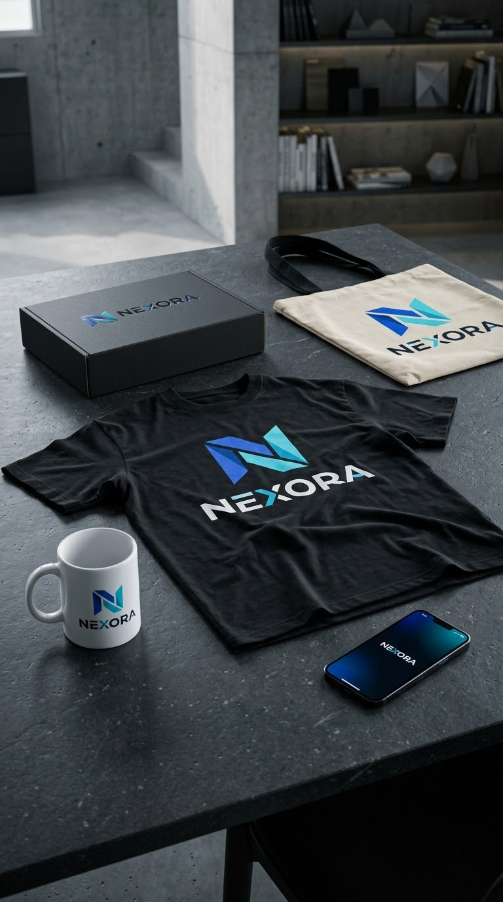

# Mockup Generator Prompts

A professional collection of highly detailed prompts for generating realistic product mockups from logos, designs, UI screens, packaging artwork, and complete brand identities.

Transform your designs into realistic **T-shirts, mugs, tote bags, packaging, billboards, smartphones, branded environments, and advertising campaigns** with accurate materials, lighting, perspective, shadows, reflections, textures, and commercial photography characteristics.

Every prompt is built as a reusable template using customizable `[VARIABLES]`, allowing the same prompt to be adapted to different brands, products, environments, and visual styles.

## Contents

| Prompt                                                          | Description                                                 |
| --------------------------------------------------------------- | ----------------------------------------------------------- |
| [`01-tshirt.md`](http://01-tshirt.md)                           | Realistic T-shirt and apparel mockup                        |
| [`02-cup.md`](http://02-cup.md)                                 | Ceramic mug product photography                             |
| [`03-tote-bag.md`](http://03-tote-bag.md)                       | Premium tote bag lifestyle mockup                           |
| [`04-packaging-box.md`](http://04-packaging-box.md)             | Branded packaging and product box                           |
| [`05-billboard.md`](http://05-billboard.md)                     | Large-scale outdoor billboard advertising                   |
| [`06-smartphone.md`](http://06-smartphone.md)                   | Smartphone and digital interface mockup                     |
| [`07-full-branding-scene.md`](http://07-full-branding-scene.md) | Complete multi-product branding environment                 |
| [`08-master-campaign.md`](http://08-master-campaign.md)         | Premium commercial campaign combining multiple mockup types |

---

## Example result



**Prompt used:** [`templates/07-full-branding-scene.md`](templates/07-full-branding-scene.md) (Mega-Prompt: Full Branding Scene).


## Features

The prompts are designed with a strong focus on visual accuracy, physical realism, and commercial production quality.

- Photorealistic commercial imagery
- Accurate product proportions
- Realistic materials and surface textures
- Physically plausible fabric deformation
- Natural folds, wrinkles, seams, and stitching
- Realistic reflections and refractions
- Accurate shadows and contact shadows
- Natural environmental lighting
- Professional studio and advertising photography
- Realistic camera perspective
- Controlled depth of field
- High-quality product presentation
- Consistent brand identity
- Precise logo and artwork placement
- Preservation of the original uploaded design
- Customizable environments and locations
- Configurable camera angles and compositions
- Dedicated negative-prompt sections
- Reusable `[VARIABLE]` system
- Cross-product visual consistency
- Adaptable commercial art direction

## Basic Usage

Each prompt contains variables enclosed in square brackets.

For example:

```text
[REFERENCE_ASSET]
[BRAND_NAME]
[PRODUCT_TYPE]
[PRODUCT_COLOR]
[PRINT_POSITION]
[PRINT_METHOD]
[LIGHTING]
[CAMERA]
[ANGLE]
[BACKGROUND]
[OUTPUT_RATIO]
[NEGATIVE_PROMPT]

```

Replace the variables with your desired values before submitting the prompt to your image-generation model.

### Example Configuration

```text
[REFERENCE_ASSET] = uploaded Azure logo
[BRAND_NAME] = Azure
[PRODUCT_TYPE] = oversized black T-shirt
[PRODUCT_COLOR] = matte black
[PRINT_POSITION] = centered on the chest
[PRINT_METHOD] = high-quality screen printing
[LIGHTING] = soft commercial studio lighting
[CAMERA] = 85mm professional product photography lens
[ANGLE] = front three-quarter view
[BACKGROUND] = minimal dark gray studio
[OUTPUT_RATIO] = 4:5

```

The resulting configuration can be inserted into the corresponding prompt to generate a realistic commercial mockup.

## Reference Assets

The prompts are designed to work with uploaded reference assets such as:

- Logos
- Brand marks
- Illustrations
- Product designs
- UI screenshots
- Typography
- Packaging artwork
- Posters
- Advertising graphics
- App interfaces
- Complete visual identities

When a reference asset is provided, the prompts instruct the image model to preserve the original artwork instead of redesigning, simplifying, or recreating it.

The reference should remain visually consistent in:

- Shape
- Typography
- Colors
- Proportions
- Composition
- Symbol placement
- Graphic details
- Relative positioning
- Visual identity

The physical presentation may change, but the underlying artwork should remain faithful to the supplied reference.

## Customization

### Product

Modify the product-related variables to generate different physical objects.

Examples:

```text
[PRODUCT_TYPE] = heavyweight cotton T-shirt
[PRODUCT_TYPE] = ceramic coffee mug
[PRODUCT_TYPE] = premium canvas tote bag
[PRODUCT_TYPE] = rigid cardboard packaging box
[PRODUCT_TYPE] = large city-center billboard
[PRODUCT_TYPE] = modern flagship smartphone

```

Additional product characteristics can be controlled through variables such as:

```text
[PRODUCT_COLOR]
[PRODUCT_MATERIAL]
[PRODUCT_SIZE]
[PRODUCT_FINISH]
[PRODUCT_SHAPE]
[PRODUCT_CONDITION]

```

### Environment

The environment can be completely customized.

Examples:

```text
[BACKGROUND] = minimal white studio
[BACKGROUND] = modern concrete architecture
[BACKGROUND] = premium retail store
[BACKGROUND] = urban street at night
[BACKGROUND] = luxury office
[BACKGROUND] = futuristic technology showroom

```

Environmental variables can also control:

```text
[LOCATION]
[ARCHITECTURE]
[PROPS]
[ATMOSPHERE]
[WEATHER]
[TIME_OF_DAY]
[ENVIRONMENTAL_DETAILS]

```

### Lighting

Lighting can be adapted to the intended visual style.

Examples:

```text
[LIGHTING] = soft diffused studio lighting
[LIGHTING] = dramatic cinematic lighting
[LIGHTING] = warm golden-hour sunlight
[LIGHTING] = overcast natural daylight
[LIGHTING] = high-end commercial product lighting

```

Additional lighting controls may include:

```text
[LIGHT_DIRECTION]
[LIGHT_INTENSITY]
[LIGHT_QUALITY]
[COLOR_TEMPERATURE]
[SHADOW_STYLE]
[REFLECTION_CONTROL]

```

### Photography

The prompts support detailed camera configuration.

Examples:

```text
[CAMERA] = 85mm portrait lens
[CAMERA] = 50mm commercial photography lens
[CAMERA] = wide-angle architectural lens
[CAMERA] = macro product photography lens

```

You can also customize:

```text
[ANGLE]
[FOCUS]
[DEPTH_OF_FIELD]
[CAMERA_HEIGHT]
[CAMERA_DISTANCE]
[FRAMING]
[COMPOSITION]
[OUTPUT_RATIO]

```

These parameters can be used to maintain consistent photography across multiple generated mockups.

## Realism Requirements

The prompts prioritize physical realism rather than simply placing a flat image over an object.

Artwork applied to fabric should naturally follow:

- Fabric folds
- Surface curvature
- Stretching
- Wrinkles
- Material texture
- Perspective
- Lighting conditions
- Local shadows
- Surface deformation

Artwork applied to packaging should respect:

- Box geometry
- Edges
- Corners
- Paper texture
- Printing characteristics
- Surface reflections
- Perspective distortion
- Material thickness
- Occlusion

Digital interfaces displayed on smartphones should respect:

- Screen geometry
- Device perspective
- Glass reflections
- Screen curvature
- Bezels
- Ambient reflections
- Viewing angle
- Realistic screen brightness

The objective is to make the final result appear as though the branded object genuinely exists in the physical world and was photographed professionally.

## Negative Prompts

Every prompt includes a dedicated `[NEGATIVE_PROMPT]` section.

The negative prompt can be customized depending on the image-generation model being used.

Typical exclusions include:

```text
distorted logo,
incorrect typography,
misspelled text,
incorrect letters,
extra letters,
missing letters,
duplicated objects,
warped geometry,
incorrect proportions,
floating objects,
unrealistic shadows,
incorrect perspective,
plastic-looking materials,
low-resolution textures,
artificial reflections,
excessive blur,
oversaturated colors,
deformed products,
cropped objects,
unwanted people,
unwanted objects,
watermarks,
random text,
AI artifacts

```

For designs containing important text or logos, additional restrictions can be added:

```text
do not redesign the logo,
do not alter the typography,
do not change the brand colors,
do not replace symbols,
do not invent additional text,
do not simplify the artwork,
do not modify the original composition

```

## Example

A complete configuration could look like:

```text
[REFERENCE_ASSET] = uploaded brand logo
[BRAND_NAME] = Azure
[PRODUCT_TYPE] = premium oversized white T-shirt
[PRODUCT_COLOR] = white
[PRINT_POSITION] = centered chest
[PRINT_METHOD] = high-quality screen printing
[LIGHTING] = soft directional studio lighting
[CAMERA] = 85mm commercial photography lens
[ANGLE] = front three-quarter angle
[BACKGROUND] = minimalist premium studio
[OUTPUT_RATIO] = 4:5

```

The corresponding prompt can then be used to generate a professional commercial mockup while maintaining the identity and visual characteristics of the original design.

## Repository Structure

```text
mockup-generator-prompts/
│
├── 01-tshirt.md
├── 02-cup.md
├── 03-tote-bag.md
├── 04-packaging-box.md
├── 05-billboard.md
├── 06-smartphone.md
├── 07-full-branding-scene.md
├── 08-master-campaign.md
└── README.md

```

## Intended Use

This repository can be used for:

- Brand visualization
- Product presentations
- Design previews
- Marketing campaigns
- Social media content
- Portfolio presentations
- E-commerce concepts
- Startup branding
- UI and product showcases
- Advertising concepts
- Creative direction
- Client presentations
- Art direction
- Brand identity exploration
- Product launch concepts

It can also be used to quickly test how an existing visual identity could appear across different physical products, digital interfaces, environments, and advertising formats.

## Prompt Philosophy

The prompts are built around four core principles.

### 1. Preserve the Design

The uploaded artwork should remain faithful to the original reference.

The prompt should prevent unnecessary modifications to logos, typography, colors, symbols, proportions, and other important brand elements.

### 2. Respect the Physical World

Products should behave like real physical objects.

Materials, geometry, surface deformation, reflections, shadows, perspective, and environmental interactions should remain physically plausible.

### 3. Control the Photography

Camera position, lens characteristics, depth of field, lighting, framing, composition, and perspective should be explicitly controlled whenever they affect the final result.

### 4. Produce Commercial-Quality Results

The final image should resemble professional advertising photography, product photography, or a high-end brand campaign rather than a generic AI-generated image.

## Future Extensions

Additional prompt categories can be added over time, including:

- Clothing collections
- Shoes
- Caps
- Posters
- Storefronts
- Vehicles
- Product labels
- Bottles and cans
- Websites
- Tablets
- Laptops
- Gaming setups
- Event banners
- Restaurant branding
- Retail interiors
- Social media advertisements
- Magazine advertisements
- Packaging collections
- Corporate environments
- Exhibition booths
- Outdoor signage
- Digital displays
- Product photography sets

## Contributing

Contributions are welcome.

When adding a new prompt:

1. Keep the prompt highly detailed and reusable.
2. Use `[VARIABLE]` placeholders for customizable parameters.
3. Include realistic material and lighting instructions.
4. Include camera and composition specifications.
5. Include a comprehensive negative prompt.
6. Avoid unnecessary model-specific assumptions.
7. Keep the prompt compatible with general image-generation workflows.
8. Preserve the existing repository structure and naming convention.
9. Keep terminology and variable naming consistent with existing prompts.
10. Avoid hardcoding brand-specific information unless required by the prompt category.

## License

The prompts in this repository can be distributed under the license specified by the repository owner.

Generated images are separate from the prompt files and may be subject to the terms, conditions, licensing requirements, and usage policies of the image-generation platform or model used to create them.

Users are responsible for ensuring that any uploaded artwork, logos, trademarks, photographs, or other reference assets are used legally and with the appropriate rights or permissions.

## Goal

The goal of this project is to provide a reusable library of professional-grade prompts for transforming existing designs into convincing real-world mockups.

Instead of manually describing every aspect of a scene, users can configure a structured set of variables and generate consistent visual presentations across multiple products, environments, and advertising formats.

The repository is intended to function as a practical prompt library for designers, developers, marketers, creators, and anyone who needs to visualize a brand or design in realistic contexts.
